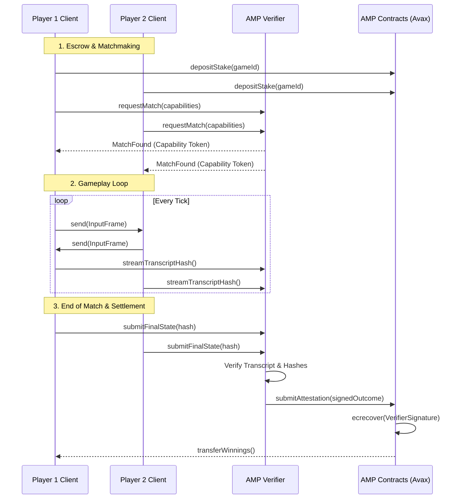

# High-Level Architecture

AMP operates by bridging the off-chain performance required for real-time multiplayer games with the on-chain security and settlement guarantees of the Avalanche blockchain. 

To achieve this, AMP splits the workload between smart contracts on Avalanche (acting as escrows and sovereign arbiters) and off-chain Verifiers (acting as high-performance matchmakers and state validators).

## The Components

### 1. AMPRegistry
The `AMPRegistry` is an Avalanche smart contract that acts as the white-pages for the protocol.
- **Game Registration:** Studios register their games, providing standard configuration formats and Cap'n Proto schema definitions.
- **Developer Identification:** Associates a specific game configuration with the deploying developer's wallet.
- **Verifier Whitelisting:** Tracks which verifiers are authorized to validate matches for specific games.

### 2. AMPSettlement
The `AMPSettlement` smart contract handles all the value transfer and final on-chain verification.
- **Escrow:** Holds player stakes (e.g., wagered AVAX or ERC-20 tokens) safely during the match.
- **Attestation Verification:** Cryptographically validates signatures from the Verifier network before executing payouts.
- **Payouts:** Distributes winnings deterministically based on the validated match outcome.

### 3. AMP Verifier / Matchmaker Server
The off-chain Rust backend that players connect to via standard Game SDKs.
- **Matchmaking:** Groups players with compatible capabilities and MMRs.
- **Capability Issuance:** Grants cryptographic capabilities to players, allowing them to participate in a specific match.
- **Transcript Validation:** During or after the match, the Verifier processes the deterministically hashed transcript of inputs/events.
- **Attestation:** Signs a cryptographic attestation confirming the final state and winner, which is then submitted to `AMPSettlement`.

---

## Settlement Modes

AMP fundamentally supports two modes of verification and settlement:

### Real-Time Hash Agreement (`RT_HASH_AGREE`)
For games where clients maintain deterministic lockstep.
- Both game clients independently calculate the state hash at the end of the match.
- They submit their final hashes to the Verifier.
- If the hashes agree, the Verifier instantly signs the attestation. No heavy replay processing is required on the server.
- **Pros:** Instant, extremely low server overhead.
- **Cons:** Game must be perfectly deterministic; vulnerable if both clients collude.

### Asynchronous Verification (`ASYNC_VERIFIER`)
For games that require robust server-side authority or where clients cannot be trusted to self-report.
- Clients stream their `InputFrames` to the Verifier.
- The Verifier (or a delegated worker node) replays the entire match using a headless build or deterministic simulation of the game engine.
- The Verifier computes the final state and signs the attestation.
- **Pros:** Maximum security, immune to client collusion.
- **Cons:** Higher compute cost for the Verifier, potential delay in settlement.

---

## Match Lifecycle: Sequence Diagram

Below is the high-level flow of a typical wagered match using AMP:

