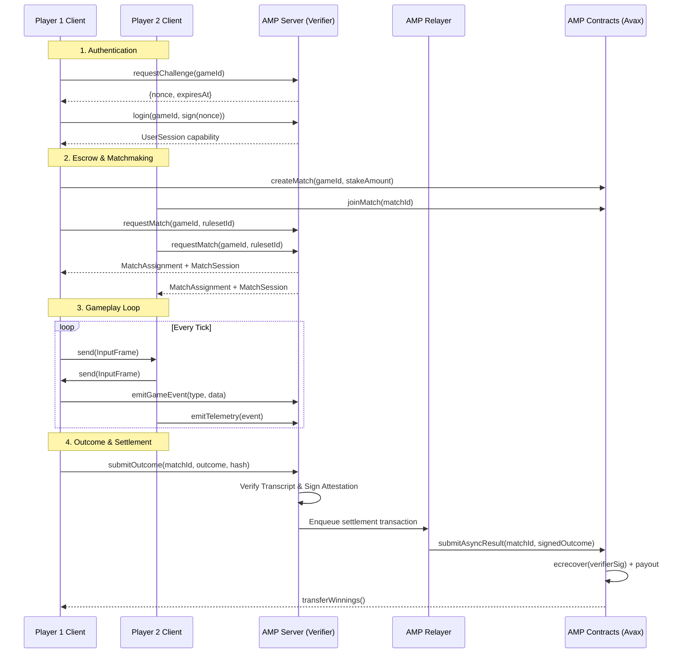

# High-Level Architecture

AMP operates by bridging the off-chain performance required for real-time multiplayer games with the on-chain security and settlement guarantees of the Avalanche blockchain.

To achieve this, AMP splits the workload between smart contracts on Avalanche (acting as escrows and sovereign arbiters) and off-chain Verifiers (acting as high-performance matchmakers and state validators).

## The Components

### 1. AMPRegistry (On-Chain)
The `AMPRegistry` is an Avalanche smart contract that acts as the white-pages for the protocol.
- **Game Registration**: Studios register their games with settlement mode, verifiers, stake token, and arbiter.
- **Match Lifecycle**: Creates matches, handles joins, cancellations, and expirations.
- **Verifier Whitelisting**: O(1) mapping lookup for authorized verifiers per game.
- **Escrow**: Holds player stakes (native AVAX or ERC-20) during matches.
- **Access Control**: Ownable2Step, Pausable, ERC2771Context (meta-transactions).

### 2. AMPSettlement (On-Chain)
The `AMPSettlement` smart contract handles attestation verification and payouts.
- **Async Verification**: Validates verifier signatures for `ASYNC_VERIFIER` matches.
- **Real-Time Hash Agreement**: Collects player hashes for `RT_HASH_AGREE` matches; auto-settles on agreement, auto-disputes on mismatch.
- **Dispute Resolution**: Designated arbiters can resolve disputed matches.
- **Payouts**: Distributes winnings deterministically with configurable protocol fee.

### 3. AMP Server / Verifier (Off-Chain)
The off-chain Rust backend that players connect to via SDKs.
- **Matchmaking**: `IndexedQueue` with `(gameId, rulesetId)` buckets sorted by MMR, binary search for skill-compatible pairs, 50ms tick.
- **Challenge-Response Auth**: Server issues time-bound nonces; clients sign with wallet keys.
- **Capability Issuance**: Grants cryptographic capabilities (`UserSession`, `MatchSession`) via Cap'n Proto RPC.
- **Transcript Validation**: Processes deterministic hashed transcripts.
- **Attestation**: Signs cryptographic attestations confirming match outcomes.
- **Match Cleanup**: Periodic cleanup loop (60s) for expired matches and auth challenges; `MAX_ACTIVE_MATCHES` cap (10K).

### 4. AMP Relayer (Off-Chain)
The settlement bridge that submits verified outcomes on-chain.
- **Persistent Queue**: Sled-backed `SettlementQueue` survives restarts.
- **EIP-1559 Gas**: Dynamic gas pricing with automatic fee bumping.
- **Nonce Tracking**: Per-account nonce management.
- **Retry**: Exponential backoff (500ms -- 4s, 5 attempts) with dead-letter queue.
- **Custodial Keys**: Domain-separated key derivation (`AMP-custodial-v1 || purpose || gameId || masterKey`).
- **Graceful Shutdown**: In-flight transactions complete before exit.

---

## Settlement Modes

AMP fundamentally supports two modes of verification and settlement:

### Real-Time Hash Agreement (`RT_HASH_AGREE`)
For games where clients maintain deterministic lockstep.
- Both game clients independently calculate the state hash at the end of the match.
- They submit their final hashes to the `AMPSettlement` contract.
- If the hashes agree, the contract auto-settles. No verifier signature needed.
- If hashes disagree, the match enters `DISPUTED` state for arbiter resolution.
- **Pros**: Instant, extremely low gas cost, no server-side replay.
- **Cons**: Game must be perfectly deterministic; requires designated arbiter for disputes.

### Asynchronous Verification (`ASYNC_VERIFIER`)
For games that require robust server-side authority or where clients cannot be trusted to self-report.
- The verifier processes the match transcript and signs an attestation.
- The `amp-relayer` submits the signed attestation to `AMPSettlement`.
- The contract verifies the signature against the whitelisted verifier set.
- **Pros**: Maximum security, immune to client collusion.
- **Cons**: Higher compute cost for the verifier, potential delay in settlement.

---

## Match Lifecycle: Sequence Diagram

Below is the high-level flow of a typical wagered match using AMP:

