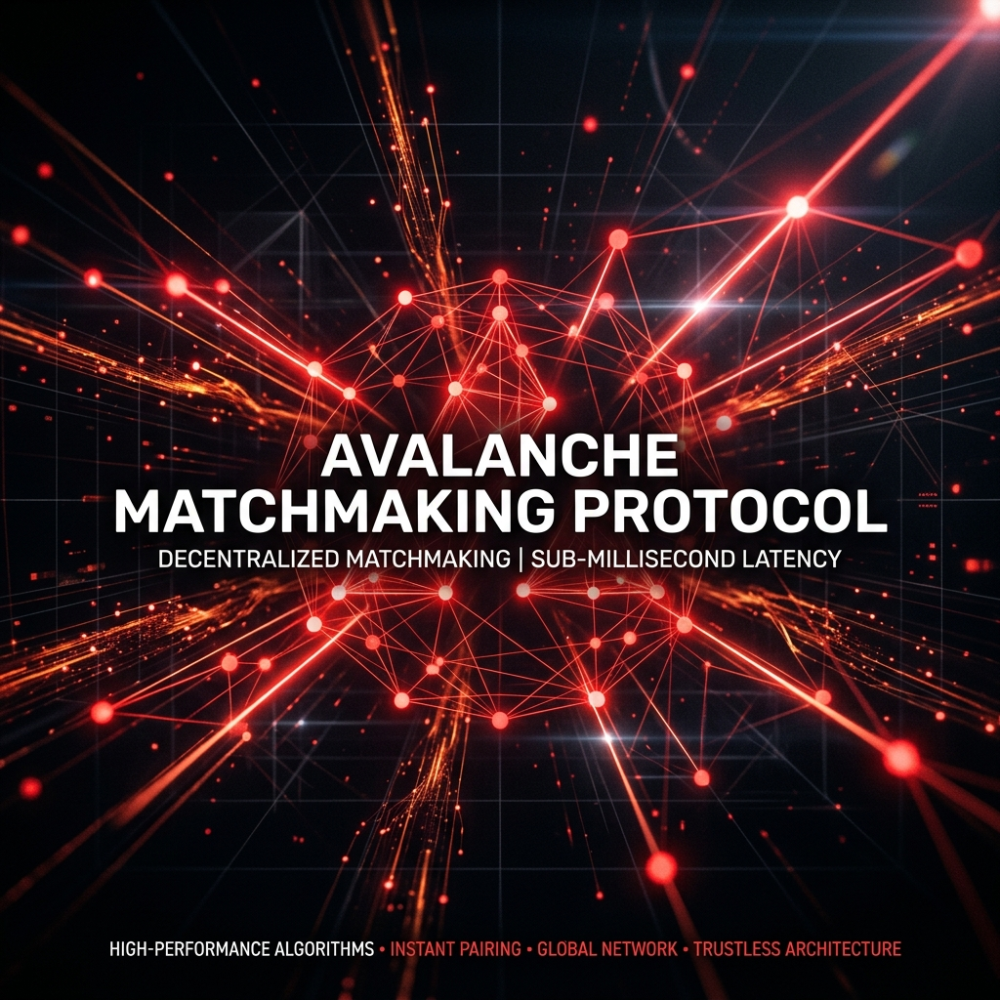

# AMP – Avalanche Matchmaking Protocol

> [!NOTE]
> **Avalanche Build Games 2026 Merit Award**  
>   
> We are proud to announce that the **Avalanche Matchmaking Protocol** was awarded a **$15,000.00 Merit Grant** for finishing in the **top 20 projects** in the prestigious **Avalanche Build Games 2026** competition.

---

AMP is a capability-based matchmaking protocol and off-chain verifier network designed to secure high-frequency Web3 game state without sacrificing sub-millisecond latency.

By removing the reliance on centralized trust and spoofable shared tokens, AMP ensures fair play and irrefutable payouts for competitive Avalanche games. The protocol pairs players, verifies deterministic game transcripts off-chain, and commits settled outcomes directly to Avalanche.

<Warning>
**Why AMP?**  
Traditional Web2 matchmaking backend lacks verifiable settlement for Web3 stakes. Putting every game tick on-chain is too slow and expensive. AMP gives you the best of both worlds: off-chain fast-action with on-chain guarantees.
</Warning>

---

## Live Deployment (Fuji Testnet)

AMP smart contracts are currently deployed on the Avalanche Fuji Testnet. You can point your game clients to these addresses to test real on-chain settlement.

| Contract | Address |
| :--- | :--- |
| **AMPRegistry** | `0x8479491220D8d56F32f1a4A5Cc827cf056a9aC34` |
| **AMPSettlement** | `0xecD9C6C1727d610A7C0Aeb3a37A6278049791a24` |

---

## Integration Highlights

AMP provides native SDKs for all major game engines and languages:

- **C++**: High-performance Unreal Engine integration.
- **C#**: Native Unity support with full .NET 8 compatibility.
- **Go**: Server-to-server matchmaking for high-frequency game backends.
- **Python**: Easy scripting for AI agents and match simulations.
- **Rust**: The core protocol and verifier implementation.

---

## Project Structure

Navigate through the sidebar to learn more about how AMP works and how to integrate it into your game:

- **Core Concept & Architecture**: Learn about the high-level design, trust model, and match transcripts.
- **Integration & SDK**: End-to-end guides for integrating AMP into your game using our native SDKs.
- **Verifier & Infra**: Details on running verifiers and the settlement attestation process.
- **Reference**: Smart contract references, Glossary, and FAQ.
